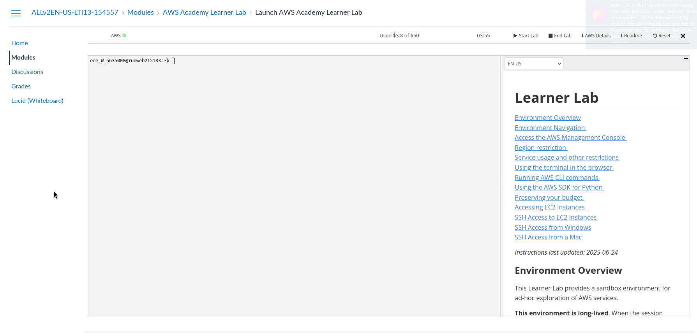
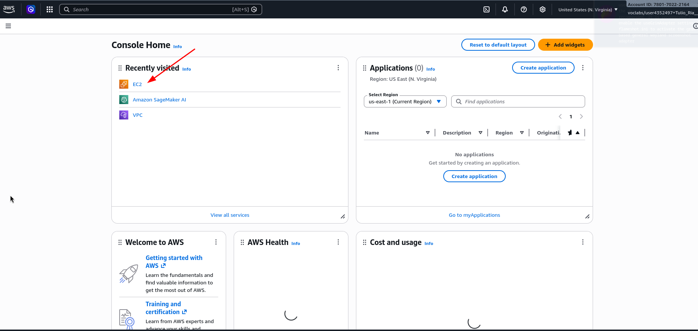
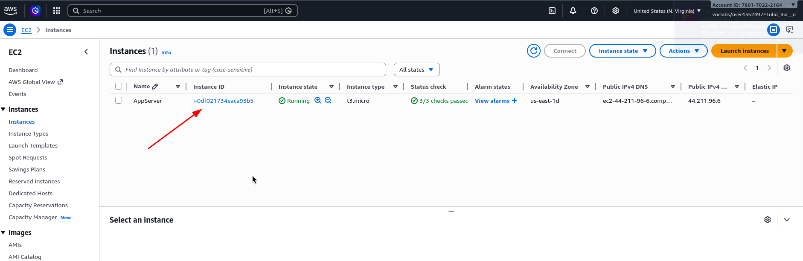
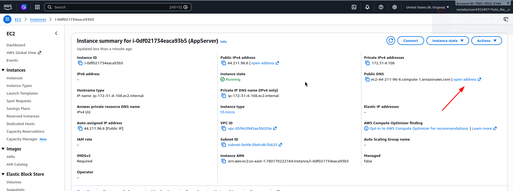
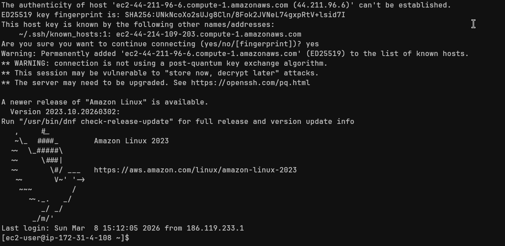
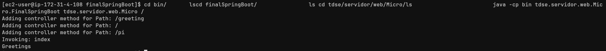

# MicroSpringBoot

## Description

MicroSpringBoot is a minimalist web server developed in Java that implements the reflective capabilities (reflection) of the language to create a basic IoC (Inversion of Control) framework. The server is capable of:

- Serving HTML pages and PNG images
- Automatically loading Beans (POJOs) with `@RestController` annotations
- Mapping methods to URIs using the `@GetMapping` annotation
- Processing request parameters with `@RequestParam`
- Handling multiple requests sequentially (non-concurrent)

This project is an educational prototype that demonstrates Java's reflection capabilities for building web applications similar to Spring Boot.

## Getting Started

These instructions will get you a copy of the project up and running on your local machine for development and testing purposes.

### Prerequisites

- Java Development Kit (JDK) 8 or higher
- Maven 3.6 or higher

### Installing

1. Clone the repository:
   ```bash
   git clone <repository-url>
   ```

2. Compile the project:
   ```bash
   mvn clean compile
   ```

## Running the Server

### Running the web server

To start the server, run:

```bash
java -cp target/classes tdse.servidor.web.ServidorWebBrowser.HttpServer
```

The server will listen on port `35000`.

### Invoking services with reflection

To invoke a controller via reflection:

```bash
java -cp target/classes tdse.servidor.web.Micro.MicroSpringBoot tdse.servidor.web.Micro.GreetingController /greeting
```

### Controller example

```java
@RestController
public class GreetingController {

    private static final String template = "Hello, %s!";
    private final AtomicLong counter = new AtomicLong();

    @GetMapping("/greeting")
    public static String greeting(@RequestParam(value = "name", defaultValue = "World") String name) {
        return "Hola " + name;
    }
}
```
## Deployment in AWS EC2

To perform the deployment on Amazon AWS, we first enter the lab module and start the respective one.



After this, we select the EC2 service, where we will launch the instance; in this case, we will use the one used in the lab session.



As i mentioned previously. we enter the instances section and select it.



In this section, we will use the DNS provided by the service to test the instance.



From the console. I connect to the instance via ssh.



By accessing the class directory that we exported from our SpringBoot micro SpringBoot and using the java cp (classpath) commmand (specifying the parameters.) We obtain the output.




## Built With

- [Java](https://www.java.com/) - Programming language
- [Maven](https://maven.apache.org/) - Dependency Management

## Authors

- **Tulio Riaño Sánchez** 

## License

This project is licensed under the MIT License - see the [LICENSE.md](LICENSE.md) file for details.

## Acknowledgments

- **CodeMia** - For the guide to get all classes in a package using reflection and URL classLoader. Knowledge obtained from [Can you find all classes in a package using reflection?](https://codemia.io/knowledge-hub/path/can_you_find_all_classes_in_a_package_using_reflection)
- Spring Boot framework inspiration
- Anyone whose code was used as reference
